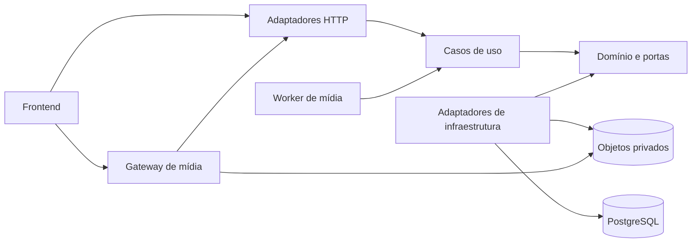
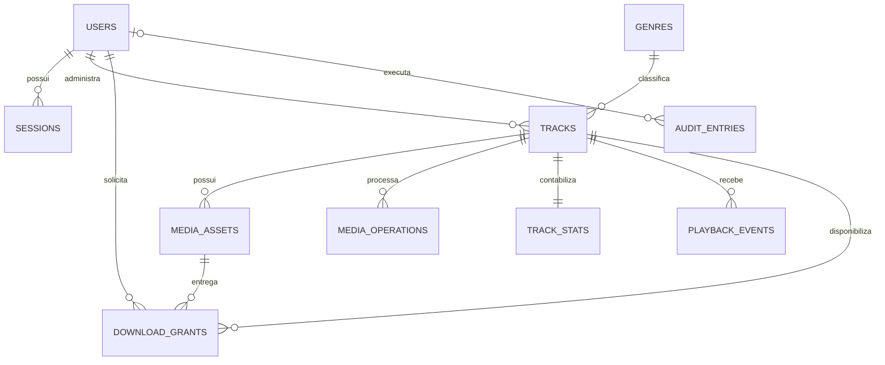

# RM Studio — PRD técnico e arquitetura de backend

Versão: 1.1 · Data: 27/09/2026 · Autor: Winston, Arquiteto de Software (BMAD)

Status: proposta técnica derivada do protótipo; não representa backend implementado nem decisões de produto já aprovadas.

## 1. Objetivo e método

Disponibilizar um acervo de gravações digitalizadas de vinil, com descoberta e reprodução públicas, download gratuito mediante cadastro e administração exclusiva do proprietário. O backend será desenvolvido em **PHP com PostgreSQL**, organizado como **monólito modular com Clean Architecture e portas/adaptadores**.

Este documento reúne requisitos, engenharia reversa, modelo de dados, contratos HTTP e desenho operacional. Destina-se à equipe que implementará e validará o backend e sua integração ao frontend. A estrutura proposta é nova e independente das pastas atuais.

O escopo inclui também a evolução visual e de usabilidade do frontend: refinamento estético, reorganização de interfaces e simplificação da manutenção com Tailwind CSS. O protótipo é referência inicial, não um layout imutável. Esta revisão define trabalho futuro; não representa alterações já implementadas na interface.

Legenda:

- **[O] Observado:** comportamento ou dado identificado no código.
- **[P] Proposto:** decisão técnica ou ajuste necessário para produção.
- **[H] Hipótese:** premissa de planejamento que exige validação antes de comprometer infraestrutura ou escopo.

A análise é estática: componentes React, HTML/CSS, handlers HTTP e esquema existente foram inspecionados. Não houve execução do aplicativo, teste de navegador ou medição de carga. Textos de interface e dados de demonstração não comprovam funcionalidades operacionais.

## 2. Evidências e engenharia reversa

Os caminhos abaixo são referências de origem, não restrições à arquitetura futura.

| Fonte | Evidência | Implicação |
|---|---|---|
| `src/components/RMStudioClient.tsx` | Catálogo, busca, filtros, cards, tabela administrativa, player, downloads e exclusão | Núcleo de catálogo, distribuição e autorização |
| `src/components/AuthModal.tsx` | Cadastro, login de visitante, login de proprietário e retomada de download | Identidade e sessões; login administrativo é apresentação, não mecanismo separado |
| `src/components/AdminTrackModal.tsx` | Autor, título, gênero, ano, álbum, equipamento, áudio e capa opcional | Administração de faixas e ingestão de mídia |
| `src/components/VinylFallbackArtwork.tsx` | Arte substituta sem capa | Capa é opcional; fallback pertence ao frontend |
| `src/components/ResponsiveCodeViewerModal.tsx` | Exibição e cópia de exemplos HTML/CSS | Ferramenta demonstrativa, sem domínio de negócio próprio |
| `public/rm-studio-responsivo.html` e `.css` | Exemplo estático de card e layout responsivo | Referência visual simplificada; não implementa todos os fluxos React |
| `src/app/page.tsx` | Carga integral do catálogo, ordenação decrescente por criação/ID | Substituir leitura direta do banco por API paginada |
| `src/db/schema.ts` | `users`, `tracks`, `download_logs` | Modelo inicial de dados, sem obrigatoriedade de preservação estrutural |
| `src/app/api/auth/*/route.ts` e `src/lib/auth.ts` | Registro, login, consulta de sessão e logout | Contratos existentes e lacunas de segurança |
| `src/app/api/tracks/route.ts` e `src/app/api/tracks/[id]/route.ts` | Listagem, criação, edição e exclusão | CRUD restrito ao proprietário |
| `src/app/api/tracks/[id]/stream/route.ts` | Streaming público e suporte parcial a Range | Reprodução progressiva e busca temporal |
| `src/app/api/tracks/[id]/download/route.ts` | Download autenticado, contador e log | Autorização e registro de concessões de download |
| `src/lib/seed.ts` e `src/lib/audio-generator.ts` | Usuários e áudio sintético de demonstração | Fixtures de desenvolvimento, nunca inicialização de produção por requisição |

### 2.1 Telas, estados e transições

| Área | Comportamento observado | Especificação de destino |
|---|---|---|
| Página inicial | Acervo público; primeira faixa selecionada, sem autoplay | Carregar primeira página e sessão independentemente; erro de sessão não deve apagar catálogo |
| Busca | Substring em autor, título, gênero, ano e álbum; insensível a maiúsculas | Executar no servidor; combinar busca, gênero e formato com AND |
| Filtros | Gêneros obtidos das faixas; formatos TODOS/MP3/FLAC/WAV | Facetas do catálogo completo, não apenas da página carregada |
| Grade/tabela | Alternância oferecida no painel do proprietário | Mesmos dados e permissões, sem entidade de banco para modo de exibição |
| Player | Play/pause, anterior/próxima, posição, duração, volume, mute | Estado local; refletir eventos reais do elemento de áudio e falhas de reprodução |
| Navegação musical | Anterior/próxima percorrem resultado filtrado com retorno às extremidades; ao terminar, pausa | [P] Com paginação, percorrer apenas página carregada no MVP, indicando esse limite na UI; faixa ausente da página leva à primeira/próxima ou última/anterior |
| Download anônimo | Abre cadastro e guarda faixa pendente | Após login/cadastro, tentar o download uma vez; cancelar modal limpa pendência |
| Autenticação | Nome/e-mail/senha no cadastro; e-mail/senha no login | Mesma autenticação para ambos os papéis; servidor determina permissões |
| Upload | Modal de metadados, áudio local e capa opcional | Mostrar upload, processamento, pronto ou falha; arquivo real obrigatório |
| Edição | Reaproveita modal; preserva arquivos omitidos; permite remover capa | Atualização parcial de metadados e substituição explícita de mídia |
| Exclusão | Confirmação inline; remove card e pausa faixa corrente | Confirmar antes da chamada; após sucesso limpar também seleção do player |
| HTML/CSS | Modal demonstrativo | Pode permanecer como conteúdo estático de desenvolvimento; não exige API |

Estados adicionais [P]: catálogo carregando/vazio/indisponível; busca sem resultados; sessão expirada; acesso negado; upload inválido; processamento falhou; atualização concorrente; faixa retirada enquanto usuário a visualiza. Falha em download não pode gerar mensagem de conclusão.

### 2.2 Divergências que não devem virar requisitos

- Senhas são armazenadas e comparadas como texto, apesar do nome `passwordHash`; o cookie contém diretamente o ID do usuário. **Substituir ambos integralmente**.
- Há credenciais demonstrativas preenchidas na UI e criadas pelo seed. Remover da distribuição de produção.
- Sem áudio enviado, a API sintetiza WAV e pode conservar rótulo FLAC/MP3. Metadados técnicos também usam valores fixos. Produção exige inspeção do conteúdo real.
- Frontend aceita ano até 2030, backend até 2100. [P] Uniformizar o intervalo em 1900–2100; validar novamente se o acervo incluir gravações anteriores.
- Contadores otimistas, preloads e requisições Range podem divergir ou contar sem escuta. Separar entrega de bytes de evento de reprodução.
- Áudios em base64 e capas como data URI no PostgreSQL são escolhas do protótipo. [P] Substituir por objetos privados e URLs de entrega.
- O indicador “ONLINE” é visual, não monitoramento. A aparência de um VU meter é simulada, não análise acústica.
- Mensagens que afirmam “direto do PostgreSQL” devem ser substituídas por mensagens sobre a ação do usuário, coerentes com a arquitetura final.

## 3. Escopo e requisitos de produto

### 3.1 Perfis e permissões

| Operação | Anônimo | `visitor` cadastrado | `admin` proprietário |
|---|---|---|---|
| Listar, buscar, consultar faixa publicada | Sim | Sim | Sim |
| Ouvir faixa publicada e consultar capa | Sim | Sim | Sim |
| Baixar arquivo original | Não | Sim | Sim |
| Criar, editar, substituir mídia, excluir | Não | Não | Sim |
| Consultar processamento e faixas não publicadas | Não | Não | Sim |
| Atribuir papel administrativo por API pública | Não | Não | Não |

[H] Instância de um único acervo, com um proprietário inicial. Não há evidência de multi-tenancy. O administrador inicial será provisionado por comando operacional autenticado, sem senha padrão. Cadastrar-se sempre resulta em `visitor`.

### 3.2 Requisitos funcionais e aceite

| ID | Requisito | Critério de aceite |
|---|---|---|
| RF-01 | Catálogo público | Retorna apenas faixas publicadas, ordenadas por `createdAt DESC, id DESC`, com total e paginação |
| RF-02 | Busca e filtros | Busca por cinco campos observados; gênero e formato restringem conjuntamente; limpar filtros restaura resultados |
| RF-03 | Reprodução pública | Sem login, reproduz, pausa e busca posição; Range válido recebe bytes corretos; preload não incrementa plays |
| RF-04 | Cadastro e sessão | E-mail único; registro cria visitante e sessão; logout invalida sessão no servidor |
| RF-05 | Download gratuito | Anônimo recebe 401; autenticado recebe original correspondente à faixa; nenhuma cobrança |
| RF-06 | Retomada pós-login | Cadastro/login iniciado por download retoma a faixa pendente uma única vez, se ainda disponível |
| RF-07 | Publicação administrativa | Visitante recebe 403; proprietário envia metadados e áudio; faixa só fica pública após processamento válido |
| RF-08 | Edição segura | Omissão preserva valor; `null` limpa campo opcional; versão antiga recebe 412, sem sobrescrever edição recente |
| RF-09 | Capa opcional | Aceita formatos observados após validação/conversão; ausência ou remoção gera fallback visual |
| RF-10 | Exclusão | Confirmação na UI; novas consultas públicas/streams/downloads recebem 404 imediatamente após retirada |
| RF-11 | Estatísticas | Plays deduplicados por evento; downloads medem concessões emitidas, não conclusão física do arquivo |
| RF-12 | Visibilidade administrativa | Proprietário acompanha processamento/falhas e pode reenviar arquivo corrigido |
| RF-13 | Refinamento visual do frontend | Catálogo, player, autenticação e administração usam padrões consistentes de cores, tipografia, espaçamento e componentes, com comparação visual antes/depois |
| RF-14 | Responsividade e acessibilidade | Fluxos principais operáveis por teclado e toque; foco visível, formulários identificados e ausência de conteúdo encoberto pelo player nas larguras de referência |

Fora do MVP: pagamentos, planos, playlists persistentes, favoritos, comentários, recomendações, múltiplos proprietários independentes, aplicativo móvel, ingestão em lote e streaming adaptativo HLS. Gestão de artistas/álbuns como cadastros próprios, verificação de e-mail e recuperação de senha são evoluções propostas, ausentes nas telas; recuperação de acesso do proprietário deve existir como procedimento operacional desde a primeira entrega.

### 3.3 Evolução visual e simplificação com Tailwind CSS

**Escopo solicitado:** permitir alterações de layout e embelezamento das telas existentes, preservando as funcionalidades, permissões e fluxos definidos neste documento. As mudanças abrangem cabeçalho, apresentação do acervo, busca/filtros, cards, tabela administrativa, player, modais, formulários e mensagens de estado.

[O] O protótipo já utiliza Tailwind CSS 4.1.17 e React/Next.js, conforme `package.json`, com importação em `src/app/globals.css`. Há também CSS próprio e valores visuais repetidos nos componentes. A proposta é consolidar esse uso, sem exigir troca do framework de frontend.

Direção visual [P]: manter como ponto de partida a identidade de vinil/hi-fi, fundo escuro, destaque âmbar e capas em evidência. Refinar hierarquia de títulos, legibilidade, alinhamento, espaçamento e equilíbrio entre elementos decorativos e ações. Ajustes de composição, cores e densidade podem ser apresentados ao proprietário durante a evolução experimental. Nova marca e alternância de temas não são requisitos desta versão.

Diretrizes de implementação:

- Usar Tailwind CSS 4 como padrão de estilização, com tokens semânticos centralizados para cores, tipografia, espaçamentos e superfícies. Definir os tokens integrados às utilidades com `@theme`; evitar repetir cores literais e valores arbitrários quando houver um padrão comum.
- Priorizar utilidades Tailwind para layout, espaçamento, tipografia, estados de interação e breakpoints mobile-first. Manter CSS específico apenas para necessidades como textura de vinil e animações que não sejam bem expressas pelas utilidades.
- Extrair componentes React reutilizáveis para botões, campos, badges, modais, cards e feedback de estado. Variantes devem usar classes completas e explícitas, evitando montagem dinâmica de nomes que não sejam detectados no build.
- Separar componentes visuais da comunicação com a API e do estado de reprodução. A padronização visual não altera regras de autorização nem contratos de dados.
- Consolidar estilos duplicados entre CSS global e componentes. Os exemplos HTML/CSS demonstrativos não serão uma segunda implementação a manter como produto.
- Não adicionar outro framework CSS ou biblioteca visual completa apenas para embelezamento. Priorizar os componentes e ícones já disponíveis, avaliando dependências específicas apenas se houver necessidade concreta.

O Tailwind documenta tokens via `@theme` e composição responsiva por utilidades; referências: [tema](https://tailwindcss.com/docs/theme) e [design responsivo](https://tailwindcss.com/docs/responsive-design).

Critérios de verificação da interface:

| Aspecto | Resultado esperado |
|---|---|
| Coerência visual | Mesma ação usa o mesmo padrão de botão; campos, cards e modais compartilham tokens e variantes |
| Telas de referência | Conferir 360, 768, 1024 e 1440 px de largura, incluindo títulos longos, capa ausente e mensagens de erro |
| Layout | Sem rolagem horizontal da página; tabela pode ter rolagem própria identificável; player não encobre conteúdo ou ações |
| Teclado e modais | Ações acessíveis por teclado, foco visível, foco contido no modal aberto e devolvido ao acionador ao fechar; Escape fecha quando não causar perda silenciosa de dados |
| Leitura e interação | Labels associados aos campos, nomes acessíveis nos botões de ícone, contraste mínimo de 4,5:1 em texto comum e alvos principais de toque de pelo menos 44 × 44 px |
| Estados | Loading, vazio, erro, sucesso, desabilitado e processamento distinguíveis por texto/ícone, sem depender apenas de cor |
| Movimento | Respeitar preferência por movimento reduzido e evitar animações que prejudiquem controles ou leitura |
| Regressão funcional | Busca, autenticação, upload, edição, reprodução e download continuam atendendo RF-01 a RF-12 |

## 4. Decisão de stack e arquitetura

### 4.1 Stack recomendada

| Componente | Decisão | Motivo e custo |
|---|---|---|
| Linguagem | PHP 8.5, último patch estável compatível | Requisito PHP; linha atual a fixar na imagem e no CI |
| Frontend e estilos | React/Next.js existente + Tailwind CSS 4 | Refinar as telas e consolidar componentes e tokens, simplificando a manutenção visual |
| Framework | Laravel 13, projeto API com Sanctum | Autenticação, validação, migrações, filas e storage integrados; disciplina necessária para isolar domínio |
| Persistência | PostgreSQL 18, último patch suportado | Transações, constraints, índices e busca adequados ao catálogo |
| ORM | Eloquent/Query Builder em adaptadores | Produtividade; modelos ORM não são entidades do domínio |
| Sessão | Cookie de sessão, Sanctum para frontend próprio | Revogação central, CSRF e ausência de bearer token em localStorage |
| Mídia | Object storage compatível com S3, bucket privado | Evita grandes blobs no banco; exige reconciliar banco e objetos |
| Processamento | Worker PHP invocando FFmpeg/ffprobe e conversor seguro de imagens | Inspeção real e derivada de streaming; isolar recursos e execução |
| Filas | Driver de banco no MVP; Redis se volume justificar | Menos serviços inicialmente; worker separado desde o início |
| Servidor | Nginx + PHP-FPM; frontend servido separadamente sob mesma origem | Escala horizontal da API e autorização antes da entrega de mídia |
| Qualidade | PHPUnit, PHPStan, Pint e testes HTTP/contrato | Regras, tipos, integração PostgreSQL e consistência da API |

Laravel 13 exige PHP >= 8.3; PHP 8.5 é uma versão publicada. PostgreSQL mantém política de suporte de cinco anos por versão principal. Fixar versões e patches na implementação, validando extensões e bibliotecas no CI. Fontes: [Laravel releases](https://laravel.com/framework/docs/releases), [PHP 8.5](https://www.php.net/releases/8.5/en.php), [PostgreSQL versioning](https://www.postgresql.org/support/versioning/).

A autenticação SPA por cookie é suportada pelo [Sanctum](https://laravel.com/framework/docs/13.x/sanctum). Os adaptadores usam recursos documentados de [armazenamento](https://laravel.com/framework/docs/13.x/filesystem) e [filas](https://laravel.com/framework/docs/13.x/queues).

Alternativas consideradas: Symfony com Doctrine é adequado a equipes já especializadas nessa stack, mas não oferece vantagem demonstrada neste acervo sobre a produtividade do Laravel. PHP sem framework aumenta trabalho de infraestrutura. Microserviços acrescentariam comunicação distribuída e operação antes de existir necessidade de escala independente. REST atende recursos e transferências binárias com contratos simples; GraphQL não traz benefício suficiente para este escopo.

### 4.2 Limites e dependências



- Domínio: entidades, invariantes e interfaces de repositório, sem imports de Laravel, Eloquent, HTTP ou S3.
- Aplicação: comandos/consultas, DTOs e fronteiras transacionais; usa portas para persistência, storage, autenticação e jobs.
- Infraestrutura: implementa portas e mapeia entidades para modelos Eloquent; única camada que conhece serviços externos.
- Apresentação: controllers, requests, policies e serializers; converte HTTP em casos de uso e resultados em contratos públicos.
- Módulos comunicam-se por serviços de aplicação e eventos internos explícitos. Não importam modelos Eloquent uns dos outros. Consultas de leitura podem usar joins em adaptador dedicado, sem permitir mutações cruzadas.
- Um banco e um deploy lógico, com processos web e worker escaláveis separadamente. A consistência entre objetos e PostgreSQL é eventual e coordenada por operações duráveis; não há transação distribuída.

### 4.3 Nova árvore de diretórios

```text
backend/
├── app/
│   ├── Bootstrap/Providers/          # composição e bindings das portas
│   ├── Modules/
│   │   ├── Identity/
│   │   │   ├── Domain/{Entities,ValueObjects,Repositories,Exceptions}/
│   │   │   ├── Application/{Commands,Queries,DTOs,Ports}/
│   │   │   ├── Infrastructure/{Persistence,Security}/
│   │   │   └── Presentation/Http/{Controllers,Requests,Resources}/
│   │   ├── Catalog/
│   │   │   ├── Domain/{Entities,ValueObjects,Repositories,Events}/
│   │   │   ├── Application/{Commands,Queries,DTOs,Ports}/
│   │   │   ├── Infrastructure/Persistence/
│   │   │   └── Presentation/Http/{Controllers,Requests,Resources,Policies}/
│   │   ├── Media/                   # mesmas quatro camadas; storage e processamento
│   │   ├── Distribution/            # reprodução, concessões e estatísticas
│   │   └── Audit/                   # trilha administrativa
│   └── Shared/{Domain,Application,Infrastructure}/
├── bootstrap/                       # inicialização Laravel
├── config/
├── routes/{api,web,console}.php
├── database/{migrations,factories,seeders}/
├── public/index.php
├── storage/                         # temporários/logs; não acervo definitivo
├── tests/{Unit,Integration,Feature,Contract,Architecture}/
├── docs/{openapi.yaml,adr,runbooks}/
├── deploy/{containers,nginx,workers}/
├── composer.json
└── artisan
```

Os grupos entre chaves representam diretórios/arquivos irmãos. Migrações são executadas em sequência global, com nomes identificando o módulo proprietário. `Shared` contém apenas conceitos realmente comuns, como relógio, transação e IDs; não é depósito de regras de negócio.

## 5. Domínios e modelo de dados

### 5.1 Domínios de negócio

| Domínio | Responsabilidade | Entidades principais |
|---|---|---|
| Identidade e acesso | Cadastro, autenticação, sessão e papéis | User, Session |
| Catálogo | Metadados, gênero e ciclo de publicação | Track, Genre |
| Mídia | Arquivo original, derivadas, validação e processamento | MediaAsset, MediaOperation |
| Distribuição | Escuta pública, autorização de download e contagem | PlaybackEvent, DownloadGrant, TrackStats |
| Auditoria | Rastreabilidade de mutações administrativas | AuditEntry |

[P] Autor permanece texto: o protótipo admite nomes compostos e não tem cadastro de artistas. Álbum, prensagem e equipamento permanecem metadados opcionais da faixa. Não presumir relação faixa–álbum–artista que a interface não estabelece. Uma faixa tem um único formato original ativo; MP3/FLAC/WAV são alternativas, não três downloads obrigatórios.

### 5.2 Convenções

IDs de negócio: UUID; API usa strings. Tabelas e colunas em `snake_case`, JSON em `camelCase`. Datas em `timestamptz`, respostas ISO 8601 UTC. PKs e campos obrigatórios são `NOT NULL`; `?` indica nullable. Todo enum abaixo recebe CHECK ou enum equivalente. Campos `created_at`/`updated_at` usam UTC. IDs do protótipo terão mapa explícito de migração.

### 5.3 Entidades e atributos

| Tabela | Atributos e restrições |
|---|---|
| `users` | `id uuid PK`, `name varchar(120)`, `email varchar(254)` normalizado e único, `password_hash varchar(255)`, `role varchar(16)` em `visitor/admin`, `status varchar(16)` em `active/disabled`, `created_at`, `updated_at` |
| `sessions` | Tabela operacional do driver de sessão Laravel: `id varchar(255) PK` aleatório, `user_id uuid? FK`, `ip_address varchar(45)?`, `user_agent text?`, `payload text`, `last_activity integer` indexado. Expiração por configuração; logout remove sessão; payload protegido e nunca exposto |
| `genres` | `id uuid PK`, `name varchar(100)`, `normalized_name varchar(100) UNIQUE`, `created_at`, `updated_at` |
| `tracks` | `id uuid PK`, `author varchar(200)`, `title varchar(250)`, `genre_id uuid FK`, `year smallint CHECK 1900..2100`, `album_name varchar(250)?`, `catalog_number varchar(100)?`, `equipment_info text?` limitado a 2.000 caracteres, `status varchar(16)` em `processing/published/failed/deleted`, `original_asset_id uuid?`, `stream_asset_id uuid?`, `cover_asset_id uuid?`, `created_by uuid FK`, `updated_by uuid FK`, `version integer > 0`, `published_at timestamptz?`, `deleted_at timestamptz?`, `created_at`, `updated_at` |
| `media_assets` | `id uuid PK`, `track_id uuid FK`, `kind varchar(24)` em `original/stream/cover`, `storage_key text UNIQUE`, `original_name varchar(255)`, `source_format varchar(10)`, `mime_type varchar(100)`, `size_bytes bigint >= 0`, `sha256 char(64)`, `duration_ms bigint?`, `sample_rate_hz integer?`, `bit_depth smallint?`, `channels smallint?`, `bitrate_bps integer?`, `width integer?`, `height integer?`, `state varchar(16)` em `staged/ready/failed/retired`, `created_at`, `updated_at` |
| `media_operations` | `id uuid PK`, `track_id uuid FK`, `requested_by uuid FK`, `type varchar(24)` em `create/replace_audio/replace_cover/purge`, `status varchar(16)` em `pending/running/succeeded/failed`, `target_version integer`, `candidate_asset_ids jsonb`, `attempts integer`, `error_code varchar(80)?`, `created_at`, `started_at?`, `finished_at?` |
| `playback_events` | `id uuid PK` fornecido pelo cliente, `track_id uuid FK`, `user_id uuid? FK`, `qualified_at timestamptz`, `reported_position_ms bigint >= 0`; PK deduplica repetição da mesma escuta |
| `download_grants` | `id uuid PK`, `track_id uuid FK`, `asset_id uuid FK`, `user_id uuid FK`, `idempotency_key uuid`, `expires_at timestamptz`, `created_at`; UNIQUE(`user_id`,`idempotency_key`) |
| `track_stats` | `track_id uuid PK/FK`, `plays_count bigint >= 0 DEFAULT 0`, `downloads_count bigint >= 0 DEFAULT 0`, `updated_at` |
| `audit_entries` | `id uuid PK`, `actor_id uuid? FK`, `action varchar(80)`, `entity_type varchar(80)`, `entity_id uuid`, `changes jsonb` com allowlist sem segredos, `request_id uuid`, `created_at` |

Tabelas técnicas adicionais: `jobs`, `failed_jobs` e `cache`/`cache_locks` quando drivers de banco forem usados. Não são domínios de negócio. Operações de mídia pendentes são persistidas junto à mutação da faixa; um dispatcher recuperável entrega jobs, inclusive após falha entre commit e enqueue.

`media_assets.track_id` define propriedade. FKs dos ponteiros ativos devem impedir referência a asset de outra faixa (FK composta `(asset_id, track_id)` com chave única correspondente). O caso de uso valida também `kind`, estado `ready` e compatibilidade. Criar faixa antes dos assets e adicionar ponteiros na publicação evita dependência circular na inserção.

FKs de conteúdo usam RESTRICT durante vida útil; usuário desativado não perde auditoria. Uma eventual exclusão de conta deve anonimizar ou remover dados pessoais conforme política definida, sem cascata acidental sobre o acervo. Logs não repetem o e-mail do usuário. Exclusão de faixa é lógica antes da limpeza de objetos.



### 5.4 Índices e integridade

- UNIQUE sobre e-mail normalizado; o banco arbitra cadastros concorrentes, convertendo violação em 409.
- Índice parcial em `tracks(created_at DESC,id DESC) WHERE status='published'`; índices em gênero/status e FKs de assets/operações.
- Busca inicial com `ILIKE` parametrizado, escapando `%` e `_` fornecidos pelo usuário. Para crescimento, coluna de busca normalizada mantida na mesma transação e GIN `gin_trgm_ops`; ano é incluído como texto. Busca curta é limitada por paginação e timeout.
- Índices em `media_operations(status,created_at)`, `download_grants(expires_at)` e eventos por `(track_id,qualified_at)`.
- Contadores incrementados atomicamente somente quando inserção de evento/concessão for nova, na mesma transação. Nunca aceitar contadores do frontend.

O PostgreSQL oferece índices GiST/GIN por trigramas úteis a buscas `LIKE`/`ILIKE`; ver [pg_trgm](https://www.postgresql.org/docs/18/pgtrgm.html). A necessidade do índice deve ser confirmada com planos e volume representativo.

## 6. Regras de negócio e processamento

### 6.1 Validações [P]

- Autor/título/gênero obrigatórios após trim, respeitando limites do modelo. Ano deve ser inteiro completo; rejeitar `1972abc`.
- Nome 2–120 caracteres; e-mail válido até 254; senha 12–128 caracteres, sem trim silencioso, armazenada com Argon2id. Nunca aceitar `role`, hash, contador ou status de publicação do cliente.
- Áudio obrigatório na criação: MP3, FLAC ou WAV validado por conteúdo e decodificação; extensão/MIME informados são apenas indícios. Limite inicial [H]: 500 MiB por arquivo.
- Capa opcional: JPG/JPEG/PNG/BMP/SVG/GIF, até 10 MiB e 25 megapixels [H]. Converter para imagem raster segura; GIF usa primeiro frame. SVG não é servido diretamente e deve ser processado sem rede, scripts, entidades externas ou leitura de arquivos locais.
- Derivar duração, formato, tamanho, taxa de amostragem e profundidade do arquivo real. `bitDepth` pode ser null em áudio com compressão com perdas; não anunciar qualidade inexistente.
- `catalogNumber` é opcional e não único: várias faixas podem compartilhar catálogo. Campos opcionais ausentes na criação ficam null; não gerar equipamentos ou álbuns fictícios.

### 6.2 Publicação e substituição

1. Administrador envia arquivo(s); API valida autenticação, limites e metadados e grava conteúdo em staging privado, sem carregá-lo inteiro em memória.
2. Transação cria faixa `processing`, assets `staged`, operação `pending` e auditoria. Resposta 202 significa recebimento, não publicação concluída.
3. Dispatcher agenda operação durável; worker realiza inspeção, calcula hash e extrai metadados. Gera MP3 para streaming quando original for FLAC/WAV; MP3 original válido pode ser reutilizado sem nova compressão.
4. Capa é normalizada. Worker promove assets prontos e publica ponteiros em uma transação, verificando versão e se a faixa continua ativa.
5. Falha inicial deixa faixa `failed`, invisível ao público e consultável pelo admin. Falha de substituição preserva versão publicada anterior.
6. Substituição prepara nova mídia antes da troca atômica. Apenas uma operação mutável por faixa por vez; concorrente recebe 409. Edição/exclusão incrementa versão, impedindo job antigo de republicar conteúdo retirado.
7. Objetos antigos recebem `retired` e são eliminados por job após janela de 24 h [H]. Reconciliador remove staging órfão e reexecuta limpeza interrompida.

Não há promessa de atomicidade entre PostgreSQL e storage. Compensações, chaves imutáveis, jobs idempotentes e reconciliação são obrigatórios. Proibir sobrescrita de objeto ativo em lugar de criar nova versão.

### 6.3 Distribuição e métricas

Streaming público significa que os bytes reproduzidos podem ser capturados; cadastro controla a conveniência e o acesso ao download do **original**, não constitui DRM. A derivada MP3 deve ser apresentada como tal; o badge do catálogo continua mostrando formato original.

Play [P]: cliente emite um UUID por sessão de reprodução e comunica evento após 10 segundos efetivamente reproduzidos, ou ao terminar faixa menor. Pausar/retomar e buscar posição preservam esse UUID; nova escuta após término cria outro. Servidor deduplica e limita taxa. É métrica aproximada reportada pelo cliente, não prova antifraude. GET/HEAD/Range nunca incrementam plays.

Download [P]: contador mede concessões válidas emitidas. POST idempotente registra concessão e incremento atomicamente. GETs de arquivo, retries e ranges não incrementam novamente. Não afirmar que o usuário terminou de baixar; confirmação desse fato não é observável apenas pela emissão HTTP.

## 7. Contratos REST

### 7.1 Convenções globais

Base `/api/v1`. JSON UTF-8, exceto uploads multipart e respostas binárias. IDs UUID em string. Rotas públicas leem somente conteúdo publicado. Recursos inexistentes, excluídos ou não publicados recebem 404 para público. Admin consulta os estados internos por rotas próprias.

Sessão via cookie `HttpOnly; Secure; SameSite=Lax; Path=/`. Mesma origem recomendada. Cliente obtém CSRF por `GET /sanctum/csrf-cookie` (204, sem corpo), envia cookies e `X-XSRF-TOKEN` nas mutações, inclusive login/cadastro. Logout invalida sessão e renova token CSRF; login regenera ID de sessão. Proposta de expiração: 2 h de inatividade e 24 h absolutas, aplicadas pelo servidor.

Respostas privadas usam `Cache-Control: no-store`. ETag de faixa corresponde à versão editorial, não aos contadores. PATCH, DELETE e substituições exigem `If-Match: "track-<id>-v<version>"`; ausência gera 428, divergência 412. API aplica allowlist de campos e rejeita campos desconhecidos com 422.

Erros:

```json
{
  "error": {
    "code": "VALIDATION_ERROR",
    "message": "Revise os campos informados.",
    "fields": {"year": ["Informe um inteiro entre 1900 e 2100."]},
    "requestId": "e720c618-82dd-4875-9181-c74044111a20"
  }
}
```

400: JSON/query malformado; 401: sessão ausente/expirada; 403: papel ou CSRF inválido; 404: recurso indisponível; 409: duplicidade/operação conflitante; 412: versão divergente; 413: upload excedido; 415: tipo de conteúdo não suportado; 422: validação de campos/arquivo; 428: precondição ausente; 429: limite com `Retry-After`; 503: dependência temporariamente indisponível. Exceções internas recebem 500 sem stack trace público.

### 7.2 Inventário de endpoints

Todas as rotas abaixo usam a base `/api/v1`, exceto CSRF e probes explicitamente indicados. GET/HEAD não possuem corpo de requisição; DELETE de faixa também não.

| Método e rota | Acesso | Entrada | Sucesso |
|---|---|---|---|
| POST `/auth/register` | Público + CSRF | Nome, e-mail, senha | 201 `{user}` + cookie |
| POST `/auth/login` | Público + CSRF | E-mail, senha | 200 `{user}` + cookie |
| GET `/auth/me` | Todos | Cookie opcional | 200 `{user: objeto ou null}` |
| POST `/auth/logout` | CSRF | `{}` | 204, sem corpo; idempotente |
| GET `/tracks` | Público | `q,genreId,format,page,perPage` | 200 `{data,meta,links}` |
| GET `/tracks/{id}` | Público | UUID | 200 `{data: Track}` + ETag |
| GET `/catalog/facets` | Público | Sem parâmetros | 200 `{genres,formats}` |
| GET `/admin/tracks` | Admin | Mesmos filtros + `status` opcional | 200 lista incluindo processamento/falhas |
| GET `/admin/tracks/{id}` | Admin | UUID | 200 `{data: Track}` + ETag |
| POST `/tracks` | Admin | Multipart metadados + `audioFile`, `coverFile?` | 202 `{trackId,operation}` |
| PATCH `/tracks/{id}` | Admin | JSON parcial + If-Match | 200 `{data: Track}` + novo ETag |
| POST `/tracks/{id}/audio` | Admin | Multipart `audioFile` + If-Match | 202 `{trackId,operation}` |
| POST `/tracks/{id}/cover` | Admin | Multipart `coverFile` + If-Match | 202 `{trackId,operation}` |
| DELETE `/tracks/{id}/cover` | Admin | If-Match | 204, novo ETag; mantém áudio |
| DELETE `/tracks/{id}` | Admin | If-Match | 204; retirada lógica e purge assíncrono |
| GET `/media-operations/{id}` | Admin | UUID | 200 `{data: Operation}` |
| GET/HEAD `/tracks/{id}/stream` | Público | Range opcional | 200/206 binário; HEAD sem corpo |
| GET/HEAD `/tracks/{id}/cover` | Público | ETag opcional | 200 imagem ou 304; 404 sem capa |
| POST `/tracks/{id}/playback-events` | Público + CSRF | UUID do evento e posição | 200 `{counted,playsCount}` |
| POST `/tracks/{id}/download-grants` | Autenticado | `{}` + Idempotency-Key | 201 `{data: DownloadGrant}`; replay 200 |
| GET/HEAD `/download-grants/{id}/file` | Mesmo usuário da concessão | Cookie + Range opcional | 200/206 original; HEAD sem corpo |
| GET `/health/live` | Probe fora da base | Sem corpo | 200 `{"status":"ok"}` |
| GET `/health/ready` | Probe restrito, fora da base | Sem corpo | 200 `{"status":"ready"}` ou 503 `{"status":"unavailable"}` |

### 7.3 Autenticação

Cadastro:

```http
POST /api/v1/auth/register
Content-Type: application/json
X-XSRF-TOKEN: <token>

{"name":"Ana Silva","email":"ana@example.com","password":"FraseDeAcesso!2026"}
```

Resposta 201; login usa somente `email` e `password` e retorna a mesma estrutura com 200:

```json
{"user":{"id":"8b24a6ac-334b-4a27-92bf-efcd2921f543","name":"Ana Silva","email":"ana@example.com","role":"visitor"}}
```

`GET /auth/me` retorna esse objeto ou `{"user":null}`. `POST /auth/logout` recebe `{}` e retorna 204. Login inválido retorna 401 com mensagem genérica; e-mail já cadastrado retorna 409. A aba “admin” não envia papel desejado nem eleva privilégios.

### 7.4 Catálogo e representação Track

Exemplo: `GET /api/v1/tracks?q=aurora&format=FLAC&page=1&perPage=24`. `q` tem no máximo 100 caracteres; `page >= 1`; `perPage` padrão 24, máximo 100. Ordem fixa por criação/ID decrescentes; paginação offset inicial, com possibilidade de mudança versionada para cursor se volume exigir. `format` filtra original. `genreId` deve ser UUID existente. Ausência de filtros representa TODOS.

```json
{
  "data": [{
    "id": "791ec44a-e1d3-48ca-b81c-f7b66bc3501a",
    "author": "Quarteto Aurora",
    "title": "Manhã de Setembro",
    "genre": {"id":"2a6f46be-d53d-4e79-9a54-60eced42bf5f","name":"Jazz Instrumental"},
    "year": 1972,
    "albumName": "Sessões de Setembro",
    "catalogNumber": "RM-001",
    "equipmentInfo": "Technics SL-1200MK2",
    "status": "published",
    "audio": {
      "format":"FLAC","mimeType":"audio/flac","fileName":"manha.flac",
      "sizeBytes":28400123,"durationSeconds":184.52,"sampleRateHz":96000,
      "bitDepth":24,"channels":2,
      "streamFormat":"MP3","streamMimeType":"audio/mpeg",
      "streamUrl":"/api/v1/tracks/791ec44a-e1d3-48ca-b81c-f7b66bc3501a/stream"
    },
    "cover": null,
    "playsCount": 32,
    "downloadsCount": 8,
    "version": 3,
    "createdAt": "2026-09-27T15:00:00Z",
    "updatedAt": "2026-09-27T16:00:00Z"
  }],
  "meta": {"page":1,"perPage":24,"total":1,"lastPage":1},
  "links": {"next":null,"previous":null}
}
```

GET individual e PATCH retornam `{"data": Track}` com todos os mesmos campos. Capa presente: `{"url":"/api/v1/tracks/<id>/cover","format":"PNG","mimeType":"image/png","width":1200,"height":1200}`; formato corresponde à imagem servida após normalização. Não retornar base64, chave privada de storage ou dados de usuário em Track.

Em consultas administrativas, faixa ainda sem mídia pronta tem `audio:null`, `cover:null`, status `processing/failed` e campo adicional `operationId` nullable. `GET /admin/tracks?status=failed` usa o mesmo envelope paginado. Público nunca recebe esses estados.

Facetas:

```json
{"genres":[{"id":"2a6f46be-d53d-4e79-9a54-60eced42bf5f","name":"Jazz Instrumental"}],"formats":["MP3","FLAC","WAV"]}
```

Gêneros listados têm ao menos uma faixa publicada; formatos são as opções suportadas. Uma combinação sem resultados retorna `data:[]`, `total:0`, `lastPage:1`, links null. A UI usa `total`, não tamanho da página, no título do acervo.

### 7.5 Criar e acompanhar processamento

Criação multipart, exemplo de partes:

```text
POST /api/v1/tracks
Content-Type: multipart/form-data; boundary=<gerado-pelo-cliente>

author = Quarteto Aurora
title = Manhã de Setembro
genre = Jazz Instrumental
year = 1972
albumName = Sessões de Setembro
catalogNumber = RM-001
equipmentInfo = Technics SL-1200MK2
audioFile = <binário manha.flac>
coverFile = <binário capa.jpg, opcional>
```

Gênero é texto livre no formulário, como no protótipo; resolver/criar gênero por nome normalizado em transação, retornando seu ID nas leituras. Normalização remove espaços externos, colapsa espaços internos e ignora caixa, sem dividir rótulos como `MPB / Soul`.

```json
{
  "trackId":"791ec44a-e1d3-48ca-b81c-f7b66bc3501a",
  "operation":{
    "id":"872cb13c-d8e4-4e7c-bdaa-3df9b5e76d71",
    "status":"pending",
    "url":"/api/v1/media-operations/872cb13c-d8e4-4e7c-bdaa-3df9b5e76d71"
  }
}
```

Resposta 202 com `Location` apontando à operação. Poll inicial a cada 2 s, aumentando até 10 s; parar em estado terminal. Exemplo GET de operação concluída:

```json
{"data":{"id":"872cb13c-d8e4-4e7c-bdaa-3df9b5e76d71","trackId":"791ec44a-e1d3-48ca-b81c-f7b66bc3501a","type":"create","status":"succeeded","error":null}}
```

Falha permanece HTTP 200 na consulta, com `status:"failed"` e `error:{"code":"INVALID_AUDIO","message":"O arquivo não pôde ser decodificado."}`. Worker não expõe comandos, caminhos internos ou saída bruta de ferramenta.

### 7.6 Edição, substituição e exclusão

```http
PATCH /api/v1/tracks/791ec44a-e1d3-48ca-b81c-f7b66bc3501a
If-Match: "track-791ec44a-e1d3-48ca-b81c-f7b66bc3501a-v3"
Content-Type: application/json

{"title":"Manhã de Setembro — Remaster","albumName":null,"genre":"Jazz Instrumental"}
```

Resposta 200 `{"data": Track}` com título atualizado, álbum null, `version:4` e novo ETag. Campos permitidos: `author,title,genre,year,albumName,catalogNumber,equipmentInfo`. Campo obrigatório não aceita null. PATCH vazio retorna 422.

Substituir áudio: `POST /tracks/{id}/audio`, multipart somente `audioFile`; substituir capa: `POST /tracks/{id}/cover`, multipart somente `coverFile`. Ambos exigem If-Match e retornam o envelope 202 da seção anterior. Versão é incrementada ao aceitar operação; resposta inclui ETag atualizado, e publicação da nova mídia incrementa novamente. Original anterior permanece disponível até sucesso. Em faixa inicial `failed`, reenviar áudio permite nova tentativa.

Remover capa: `DELETE /tracks/{id}/cover`, If-Match, sem corpo → 204, sem corpo e novo ETag; ausência de capa é sucesso idempotente se versão corresponder. Remover faixa: `DELETE /tracks/{id}`, If-Match, sem corpo → 204. Repetição após retirada retorna 404. Limpeza física é assíncrona e auditada; não anunciar exclusão física imediata.

### 7.7 Streaming e capas

```http
GET /api/v1/tracks/791ec44a-e1d3-48ca-b81c-f7b66bc3501a/stream
Range: bytes=0-1023
```

Exemplo para derivada com 4.200.000 bytes:

```http
HTTP/1.1 206 Partial Content
Content-Type: audio/mpeg
Accept-Ranges: bytes
Content-Range: bytes 0-1023/4200000
Content-Length: 1024
Content-Disposition: inline
Cache-Control: no-store

<1024 bytes do áudio>
```

Sem Range: 200 com tamanho total. Implementar ranges fechados, abertos (`bytes=1024-`) e sufixos (`bytes=-1024`). Intervalo válido além do fim é limitado ao último byte; intervalo não satisfazível retorna 416 com `Content-Range: bytes */4200000`. Range malformado ou múltiplo não suportado é ignorado e recebe 200 completo. HEAD retorna os headers de GET completo sem corpo e ignora Range. `If-Range` divergente retorna 200 completo. ETag da mídia usa versão/hash do asset, independente do ETag editorial.

Gateway consulta publicação antes de cada nova entrega e repassa bytes do objeto privado sem redirecionamento público permanente e sem materializar arquivo inteiro em PHP. Original só está disponível pela concessão autenticada. Transferência já iniciada pode terminar após retirada; novos pedidos devem falhar.

GET de capa retorna binário `image/png` ou `image/jpeg`, ETag do asset e `Cache-Control: no-cache` para revalidação; `If-None-Match` correspondente retorna 304 somente após verificar que faixa ainda está publicada. Sem capa, 404 permite fallback. Para um futuro CDN com cache público, definir explicitamente o SLA de invalidação antes de alterar essa garantia.

### 7.8 Eventos de reprodução

```http
POST /api/v1/tracks/791ec44a-e1d3-48ca-b81c-f7b66bc3501a/playback-events
Content-Type: application/json

{"id":"3571e03e-f7ad-42a6-82ab-6ae6cbf58627","positionMs":10420}
```

Resposta 200 `{"counted":true,"playsCount":33}`. Repetição do mesmo ID/faixa retorna `{"counted":false,"playsCount":33}`; ID reutilizado em outra faixa gera 409. Posição não negativa e não superior à duração com tolerância de 1 s. O cliente só deve enviar após tempo efetivamente ouvido; o servidor não consegue comprovar esse tempo pelo campo de posição. Aplicar limite por sessão anônima/IP sem transformar visitante anônimo em cadastro obrigatório.

### 7.9 Concessão e entrega de download

```http
POST /api/v1/tracks/791ec44a-e1d3-48ca-b81c-f7b66bc3501a/download-grants
Idempotency-Key: 9163d932-cdb4-4267-af22-a903e1cbb06d
Content-Type: application/json

{}
```

```json
{"data":{"id":"58a89954-538b-484d-b28d-8a4cfe783d93","url":"/api/v1/download-grants/58a89954-538b-484d-b28d-8a4cfe783d93/file","expiresAt":"2026-09-27T16:05:00Z","fileName":"Quarteto Aurora - Manhã de Setembro (1972).flac","downloadsCount":9}}
```

201 na primeira emissão; replay com mesma chave/usuário/faixa devolve mesma concessão com 200 sem novo incremento. Chave vinculada a outra faixa gera 409. Concessão expira em 5 minutos [P]; replay após expiração recebe 409 `GRANT_EXPIRED`, e usuário pode iniciar nova intenção com nova chave.

Cliente navega à URL recebida. GET exige mesma sessão de usuário, concessão vigente e faixa publicada: responde binário `audio/flac`, `Content-Disposition: attachment` com `filename` ASCII seguro e `filename*` UTF-8, `Content-Length`, `Accept-Ranges` e `Cache-Control: private, no-store`. Aplica as mesmas regras Range do stream. Concessão ausente/de outro usuário recebe 404; expirada recebe 410; sessão ausente recebe 401. Concessão fixa o asset original da emissão, mesmo se houver substituição posterior, durante a validade. Retirada da faixa bloqueia entrega.

### 7.10 Saúde e limites

Liveness verifica processo sem depender do banco. Readiness verifica PostgreSQL e acesso ao storage, com timeout curto; respostas não expõem credenciais ou detalhes de rede. Worker e backlog têm monitoramento separado.

Limites iniciais [H], configuráveis: login 5 tentativas/min por combinação IP/e-mail; cadastro 5/h por IP; catálogo 120/min por IP; eventos 30/min por sessão/IP; concessões 20/min por usuário; até 2 processamentos de mídia simultâneos por proprietário. Não aplicar limite de catálogo cegamente a requisições Range; mídia tem controle de banda e conexões próprio. Responder 429 com tempo de nova tentativa.

## 8. Segurança, operação e requisitos não funcionais

### 8.1 Controles obrigatórios

- Policies no servidor em toda mutação; nunca confiar na ausência de botão administrativo.
- HTTPS, sessão opaca e invalidável; Argon2id; CSRF; CORS restrito se origens diferentes. Desativar usuário também bloqueia sessões existentes.
- Validação de arquivos por conteúdo; chaves aleatórias, bucket privado, nomes sanitizados e `X-Content-Type-Options: nosniff`.
- Worker em processo/container com limites de CPU, memória e tempo; sem shell interpolando nomes enviados; sem rede ao converter mídia; ferramentas atualizadas.
- Segredos via ambiente/secret manager; logs sem senhas, cookies, tokens ou URLs com credenciais. Usuário SQL da aplicação sem DDL; migrações com identidade separada.
- Auditoria de criação, edição, substituição e retirada com ator, recurso, horário e request ID. Registrar falhas operacionais sem incluir conteúdo sensível.
- Política de retenção [H]: eventos e concessões por 90 dias, auditoria por 1 ano; agregados preservados. Validar retenção e gestão de dados pessoais antes do lançamento, sem assumir conformidade jurídica automática.

### 8.2 Metas de capacidade [H]

Premissa para ensaio inicial: 10 mil faixas, 1.000 usuários cadastrados, 50 consultas HTTP/s e 100 streams simultâneos. Esses números são metas de planejamento, não capacidade medida.

| Indicador | Meta proposta | Verificação |
|---|---|---|
| Consulta de catálogo | p95 <= 300 ms no servidor | Carga com dados representativos e cache frio/quente separados |
| Login/concessão | p95 <= 700 ms | Incluir hash de senha e dependências; excluir transferência do arquivo |
| Início de streaming | p95 <= 2 s | Rede de referência documentada; observar origem e cliente |
| Disponibilidade API | 99,5% mensal | Monitoramento externo e orçamento de indisponibilidade |
| Recuperação | RPO <= 24 h, RTO <= 4 h | Ensaio de restauração de banco e objetos |
| Memória de entrega | Não cresce linearmente com tamanho do arquivo | Ensaio com arquivos no limite e streams concorrentes |

100 streams MP3 a 320 kbit/s demandam aproximadamente 32 Mbit/s só de áudio, antes de overhead e downloads. A banda e o custo de saída podem dominar a operação. Processamento de mídia não tem SLA fixado antes de ensaio com arquivos reais e hardware escolhido.

### 8.3 Implantação e observabilidade

Ambientes dev/staging/prod isolados. Containers reproduzíveis; PostgreSQL preferencialmente gerenciado; storage privado com versionamento e política de ciclo de vida. Proxy publica frontend e `/api` sob a mesma origem. Web e workers compartilham apenas serviços persistentes, não disco temporário local.

Pipeline: análise estática → testes → imagem → migrações compatíveis → deploy → smoke tests. Migrações destrutivas são uma fase posterior à remoção dos consumidores antigos. Rollback da aplicação não executa automaticamente rollback destrutivo do banco. Workers antigos devem concluir ou drenar jobs compatíveis antes da troca.

Métricas: latência e status por rota, erro de login, backlog/idade de operações, duração/falha de transcodificação, conexões SQL, uso de storage, banda e falhas 5xx. Logs estruturados com request ID propagado ao job. Alertar backlog crescente, falhas repetidas e perda de acesso a objetos.

Backup diário de PostgreSQL e proteção dos objetos; testar restauração conjunta incluindo chaves referenciadas. Reconciliador identifica assets faltantes e órfãos sem excluir automaticamente objetos ativos. Reprocessamentos têm tentativas limitadas, backoff e inspeção operacional de falhas permanentes.

## 9. Integração e migração do protótipo

A integração inclui uma frente de melhoria visual conforme a seção 3.3. Começar pelo tema e componentes compartilhados; aplicar ao catálogo/player e depois aos formulários e à administração. Comparar capturas antes/depois com o proprietário e validar os estados de interação em cada etapa. A alteração de layout deve acompanhar a integração dos fluxos reais da API.

1. Implementar API PHP e contratos antes de remover handlers antigos. Frontend passa a consumir `/api/v1`; SSR encaminha cookies apenas à API confiável e deixa de acessar PostgreSQL diretamente.
2. Adaptar `TrackItem`: ID numérico → UUID; gênero textual → objeto; campos de áudio → `audio`; `coverData` → URL; `sampleRate` textual → valores técnicos. Um mapper temporário pode preservar os componentes durante a transição.
3. Substituir PUT multipart de edição por PATCH JSON e endpoints de mídia. O modal deve aguardar publicação ou exibir estado de processamento, em vez de inserir imediatamente um item público.
4. Mover busca/filtros para servidor, com debounce e cancelamento de respostas antigas. Buscar facetas separadamente e usar `meta.total`.
5. Remover incrementos otimistas não reconciliados. Play envia evento qualificado; download primeiro solicita concessão; após login, retomar intenção pendente com sessão efetiva.
6. Exportar faixas e gerar mapa IDs antigos/UUIDs. Decodificar base64 uma vez, inspecionar o arquivo, gravar objeto e verificar checksum/tamanho antes de registrar ponteiro. Corrigir formatos rotulados incorretamente; quarentenar inconsistências.
7. Dados sintéticos permanecem fixtures, não são assumidos como acervo real. Se existirem contas reais no protótipo, invalidar sessões e exigir redefinição de senha por procedimento seguro; não transportar texto puro como hash. Conta demonstrativa administrativa deve ser descartada.
8. Recalcular metadados e revisar logs órfãos. Contadores históricos importados são um baseline, pois a semântica anterior é diferente. Documentar data de início da nova contagem.
9. Fazer ensaio em staging, backup e janela de congelamento de escrita; validar amostras de catálogo, reprodução e download antes do corte. Reverter roteamento se falhar, preservando exportação e mapa de IDs; não operar duas fontes graváveis simultaneamente.

## 10. Plano de entrega e verificação

| Etapa | Entrega | Condição de conclusão |
|---|---|---|
| E1 — Fundação | Estrutura modular, migrations, identidade, sessão e autorização | Nenhuma escalada de papel por cookie ou payload; cadastro concorrente consistente |
| E2 — Catálogo | CRUD de metadados, busca, facetas, paginação, ETags | Filtros/ordem corretos; atualização concorrente protegida |
| E3 — Mídia | Upload privado, operações duráveis, validação, derivadas e capas | MIME falso rejeitado; falha mantém versão anterior; exclusão vence worker concorrente |
| E4 — Distribuição | Range, eventos de play e concessões autenticadas | Bytes corretos, deduplicação e autorização independentes da UI |
| E5 — Integração e melhoria visual | Frontend adaptado, refinado com Tailwind CSS e migração ensaiada | RF-01 a RF-14 atendidos; comparação visual, teclado e larguras de referência verificados |
| E6 — Operação | Monitoramento, limites, backup e deploy | Testes de carga e restauração satisfazem metas acordadas |

Testes necessários:

- Frontend: build, lint e verificação de tipos; testes dos fluxos afetados e inspeção visual responsiva, foco/teclado, contraste, movimento reduzido e estados de erro. Validar componentes representativos sem criar testes que apenas repitam classes CSS.

- Unitários para invariantes de faixa, transições, autorização e normalização de gênero.
- Integração com PostgreSQL real para unicidade, FKs, transações de contador e concorrência de versões; SQLite não substitui esses testes.
- Contrato HTTP para schemas, status, null/omissão, erros, CSRF e limites. Converter estes contratos em `openapi.yaml` na implementação.
- Mídia: MP3/FLAC/WAV reais, arquivo truncado, extensão falsa, SVG ativo, decompression bomb, substituição e falha de storage.
- Range: fechado/aberto/sufixo, começo além do fim, fim maior que tamanho, múltiplo, HEAD e If-Range; validar bytes e headers.
- Concorrência: duas edições, retries de concessão, evento duplicado, exclusão durante processamento e falha após commit antes de enqueue.
- E2E: visitante ouve → pede download → cadastra → baixa; visitante tenta administrar e recebe 403; proprietário publica → edita → remove capa → exclui; sessão expira durante download.
- Falhas: banco/storage indisponível, worker reiniciado e job duplicado; UI deve distinguir erro de consulta, processamento e reprodução.

## 11. Decisões pendentes e premissas

| Questão | Premissa adotada nesta proposta | Momento de resolver |
|---|---|---|
| PostgreSQL precisa conter também os binários? | Não: exigência interpretada como banco do sistema; mídia em objetos | Antes de contratar storage; se houver exigência contrária, reavaliar `bytea`/large objects e custos |
| Escala, orçamento e hospedagem | Acervo único e metas da seção 8 | Antes de dimensionar produção |
| Streaming precisa ser lossless? | MP3 público de reprodução e original autenticado para download | Antes de fechar pipeline e comunicação de qualidade |
| Retirada implica eliminação física imediata? | Ocultação imediata; purge após janela de 24 h; backups seguem retenção | Antes de aprovar mensagens e política operacional |
| Cadastro exige e-mail verificado? | Não no MVP, coerente com retomada imediata observada | Antes de abrir cadastro público |
| Formatos/tamanhos de capa e áudio | Preservar formatos observados; limites propostos nas validações | Validar com arquivos reais antes de implementar ingestão |
| Distribuição do acervo | Proprietário define quais gravações podem ser publicadas | Antes de importar/publicar acervo real |
| Recuperação de acesso | Procedimento seguro para proprietário; autosserviço futuro para visitantes | Definir atendimento mínimo antes do lançamento |

Essas premissas não bloqueiam a leitura e o planejamento deste PRD. Alterações em storage, qualidade do streaming, política de acesso ou exclusão exigem revisão explícita dos contratos e decisões correspondentes antes da implementação.
